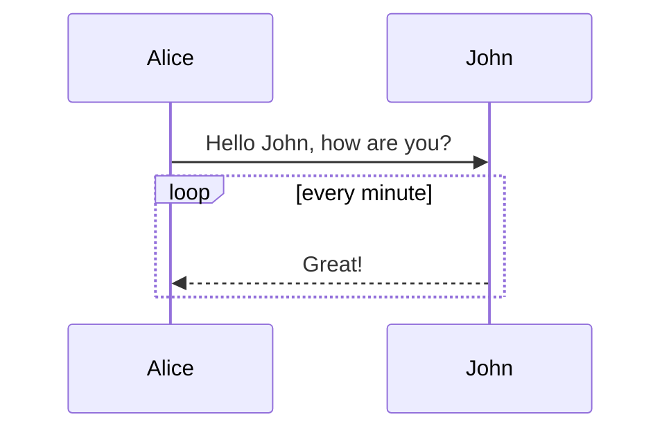

**目录**

- [Markdown 简明语法手册](#Markdown 简明语法手册) 
    - [1. 斜体和粗体](#1. 斜体和粗体) 
    - [2. 分级标题](#2. 分级标题) 
    - [3. 超链接](#3. 超链接) 
    - [4. 无序列表](#4. 无序列表) 
    - [5. 有序列表](#5. 有序列表) 
    - [6. 文字引用](#6. 文字引用) 
    - [7. 行内代码块](#7. 行内代码块) 
    - [8. 代码块](#8. 代码块) 
    - [9. 插入图像](#9. 插入图像) 
- [Markdown 高阶语法手册](#Markdown 高阶语法手册) 
    - [1. 内容目录](#1. 内容目录) 
    - [2. 标签分类](#2. 标签分类) 
    - [3. 删除线](#3. 删除线)
    - [4. 注脚](#4. 注脚) 
    - [5. LaTeX 公式](#5. LaTeX 公式) 
    - [6. 加强的代码块](#6. 加强的代码块) 
    - [7. 流程图](#7. 流程图) 
    - [8. 序列图](#8. 序列图) 
    - [9. 甘特图](#9. 甘特图) 
    - [10. Mermaid 流程图](#10. Mermaid 流程图)
    - [11. Mermaid 序列图](#11. Mermaid 序列图) 
    - [12. 表格支持](#12. 表格支持)
    - [13. 定义型列表](#13. 定义型列表) 
    - [14. Html 标签](#14. Html 标签) 
    - [15. 内嵌图标](#15. 内嵌图标) 
    - [16. 待办事宜 Todo 列表](#16. 待办事宜 Todo 列表)

# Markdown 简明语法手册

[打开子文件所在的位置](Markdown 简明语法手册.assets)

标签： Cmd-Markdown

---

## 1. 斜体和粗体

使用 `*` 和 `**` 表示斜体和粗体。

示例：

```markdown
这是*斜体*，这是**粗体**。
```

这是*斜体*，这是**粗体**。

## 2. 分级标题

使用 === 表示一级标题，使用 --- 表示二级标题。

示例：

```markdown
这是一个一级标题
============================

这是一个二级标题
--------------------------------------------------

### 这是一个三级标题
```


这是一个一级标题
============================

这是一个二级标题
--------------------------------------------------

### 这是一个三级标题

你也可以选择在行首加`#`号表示不同级别的标题 (H1-H6)，例如：`#` （H1）、 `##`（H2）、 `###` （H3）…… `######` （H6）。

示例：

```markdown
# 一级标题

## 二级标题

### 三级标题

#### 四级标题

##### 五级标题

###### 六级标题
```

# 一级标题

## 二级标题

### 三级标题

#### 四级标题

##### 五级标题

###### 六级标题

## 3. 超链接

使用 

```markdown
[描述](链接地址) 
```

为文字增加超链接（支持URL、相对路径或绝对路径）。

### 示例1：网址

这是去往 [百度](https://www.baidu.com/) 的链接。（URL）

### 示例2：本地路径

这是去往 [Sublime Text 所在目录](C:\Program Files\Sublime Text) 的链接。（文件夹的绝对路径）

这是打开 [Sublime Text](C:\Program Files\Sublime Text\sublime_text.exe) 的链接。（文件的绝对路径）

这是打开 [当前目录下的文件夹](./语文/) 的链接。（相对路径）

父级目录符号 ``../`` 来返回到上一级目录。
如：

```Markdown
[Link to README](../../README.md)
```

是链接到父目录的父目录下的 `README.md` 文件。

### 示例3：文件内定位

链接到当前文件内的某个标题处：

```markdown
[描述](#当前文档内的标题)
[跳转到当前文件的“1. 斜体和粗体”标题的超链接](#1. 斜体和粗体)
```

[跳转到当前文件的“1. 斜体和粗体”标题的超链接](#1. 斜体和粗体)

链接到另一个 Markdown 文档的某个标题处：

```markdown
[描述](Markdown文件的路径#该文件内的标题)
[跳转到同目录下的“LaTeX 数学公式.md”文件里的“10	数学符号表”标题的超链接](./LaTeX 数学公式.md#10	数学符号表)
```

[跳转到同目录下的“LaTeX 数学公式.md”文件里的“10	数学符号表”标题的超链接](./LaTeX 数学公式.md#10	数学符号表)

## 4. 无序列表

使用 `*` 或 `+` 或 `-` 表示无序列表。

示例：

```Markdown
- 无序列表项 一
- 无序列表项 二
- 无序列表项 三
```

显示为：

- 无序列表项 一
- 无序列表项 二
- 无序列表项 三

## 5. 有序列表

使用数字和点表示有序列表。

示例：

```Markdown
1. 有序列表项 一
2. 有序列表项 二
3. 有序列表项 三
```

显示为：

1. 有序列表项 一
2. 有序列表项 二
3. 有序列表项 三

## 6. 文字引用

使用 `>` 表示文字引用。

示例：

```markdown
> 野火烧不尽，春风吹又生。
```

> 野火烧不尽，春风吹又生。

## 7. 行内代码块

使用 \`代码` 表示行内代码块。

示例：

```Markdown
让我们聊聊 `html`。
```

显示为：

让我们聊聊 `html`。

## 8. 代码块

使用 四个缩进空格 表示代码块。

示例：

```Markdown
    这是一个代码块，此行左侧有四个不可见的空格。
```

显示为：

    这是一个代码块，此行左侧有四个不可见的空格。

## 9. 插入图像

使用

```markdown

```

插入图像。

示例：

```Markdown

```

显示为：


# Markdown 高阶语法手册

## 1. 内容目录

在段落中填写 `[TOC]` 以显示全文内容的目录结构。

@[toc]

## 2. 标签分类

在编辑区任意行的列首位置输入以下代码给文稿标签：

标签： 数学 英语 Markdown

或者

Tags: 数学 英语 Markdown

## 3. 删除线

使用 ~~ 表示删除线。

例如：

```Markdown
~~这是一段错误的文本。~~
```

显示为：

~~这是一段错误的文本。~~

## 4. 注脚

使用 [^注脚名] 表示注脚。

这是一个注脚[^footnote]的样例。

这是第二个注脚[^footnote2]的样例。

## 5. LaTeX 公式

`$` 表示行内公式： 

质能守恒方程可以用一个很简洁的方程式 $E=mc^2$ 来表达。

`$$` 表示整行公式：

```markdown
$$
\sum_{i=1}^n a_i=0
$$

$$
f(x_1,x_x,\ldots,x_n) = x_1^2 + x_2^2 + \cdots + x_n^2 
\\
\sum^{j-1}_{k=0}{\widehat{\gamma}_{kj} z_k}
$$
```

$$
\sum_{i=1}^n a_i=0
$$

$$
f(x_1,x_x,\ldots,x_n) = x_1^2 + x_2^2 + \cdots + x_n^2 
\\
\sum^{j-1}_{k=0}{\widehat{\gamma}_{kj} z_k}
$$

学习 Latex 获得更多使用方法。

## 6. 加强的代码块

支持四十一种编程语言的语法高亮的显示，行号显示。

非代码示例：

```
$ sudo apt-get install vim-gnome
```

Python 示例：

```python
@requires_authorization
def somefunc(param1='', param2=0):
    '''A docstring'''
    if param1 > param2: # interesting
        print 'Greater'
    return (param2 - param1 + 1) or None

class SomeClass:
    pass

>>> message = '''interpreter
... prompt'''
```

JavaScript 示例：

```javascript
/**
* nth element in the fibonacci series.
* @param n >= 0
* @return the nth element, >= 0.
*/
function fib(n) {
  var a = 1, b = 1;
  var tmp;
  while (--n >= 0) {
    tmp = a;
    a += b;
    b = tmp;
  }
  return a;
}

document.write(fib(10));
```

## 7. 流程图

### 示例

```mermaid
flowchat
st=>start: Start:>https://www.zybuluo.com
io=>inputoutput: verification
op=>operation: Your Operation
cond=>condition: Yes or No?
sub=>subroutine: Your Subroutine
e=>end

st->io->op->cond
cond(yes)->e
cond(no)->sub->io
```

### 更多语法参考：[流程图语法参考](http://adrai.github.io/flowchart.js/)

## 8. 序列图

### 示例 1

```seq
Alice->Bob: Hello Bob, how are you?
Note right of Bob: Bob thinks
Bob-->Alice: I am good thanks!
```

### 示例 2

```seq
Title: Here is a title
A->B: Normal line
B-->C: Dashed line
C->>D: Open arrow
D-->>A: Dashed open arrow
```

### 更多语法参考：[序列图语法参考](http://bramp.github.io/js-sequence-diagrams/)

## 9. 甘特图

甘特图内在思想简单。基本是一条线条图，横轴表示时间，纵轴表示活动（项目），线条表示在整个期间上计划和实际的活动完成情况。它直观地表明任务计划在什么时候进行，及实际进展与计划要求的对比。

```gantt
    title 项目开发流程
    section 项目确定
        需求分析       :a1, 2016-06-22, 3d
        可行性报告     :after a1, 5d
        概念验证       : 5d
    section 项目实施
        概要设计      :2016-07-05  , 5d
        详细设计      :2016-07-08, 10d
        编码          :2016-07-15, 10d
        测试          :2016-07-22, 5d
    section 发布验收
        发布: 2d
        验收: 3d
```

### 更多语法参考：[甘特图语法参考](https://knsv.github.io/mermaid/#gant-diagrams)

## 10. Mermaid 流程图

```graphLR
    A[Hard edge] -->|Link text| B(Round edge)
    B --> C{Decision}
    C -->|One| D[Result one]
    C -->|Two| E[Result two]
```

### 更多语法参考：[Mermaid 流程图语法参考](https://knsv.github.io/mermaid/#flowcharts-basic-syntax)

## 11. Mermaid 序列图



### 更多语法参考：[Mermaid 序列图语法参考](https://knsv.github.io/mermaid/#sequence-diagrams)

## 12. 表格支持

| 项目   |   价格 | 数量 |
| ------ | -----: | :--: |
| 计算机 | \$1600 |  5   |
| 手机   |   \$12 |  12  |
| 管线   |    \$1 | 234  |

## 13. 定义型列表

### 示例1

```Markdown
名词 1
:   定义 1（左侧有一个可见的冒号和四个不可见的空格）

代码块 2
:   这是代码块的定义（左侧有一个可见的冒号和四个不可见的空格）

        代码块（左侧有八个不可见的空格）
```

显示为：

名词 1
:   定义 1（左侧有一个可见的冒号和四个不可见的空格）

代码块 2
:   这是代码块的定义（左侧有一个可见的冒号和四个不可见的空格）

        代码块（左侧有八个不可见的空格）

### 示例2：定义型列表的嵌套

```HTML
<dl>
    <dt>Term 1</dt>
    <dd>Definition of Term 1.</dd>
    <dd>
        <dl>
            <dt>Nested term 1-1</dt>
            <dd>Definition of nested term 1-1.</dd>
            <dt>Nested term 1-2</dt>
            <dd>Definition of nested term 1-2.</dd>
        </dl>
    </dd>
    <dt>Term 2</dt>
    <dd>Definition of Term 2.</dd>
    <dd>
        <dl>
            <dt>Nested term 2-1</dt>
            <dd>Definition of nested term 2-1.</dd>
            <dt>Nested term 2-2</dt>
            <dd>Definition of nested term 2-2.</dd>
        </dl>
    </dd>
</dl>
```

显示为：

<dl>
    <dt>Term 1</dt>
    <dd>Definition of Term 1.</dd>
    <dd>
        <dl>
            <dt>Nested term 1-1</dt>
            <dd>Definition of nested term 1-1.</dd>
            <dt>Nested term 1-2</dt>
            <dd>Definition of nested term 1-2.</dd>
        </dl>
    </dd>
    <dt>Term 2</dt>
    <dd>Definition of Term 2.</dd>
    <dd>
        <dl>
            <dt>Nested term 2-1</dt>
            <dd>Definition of nested term 2-1.</dd>
            <dt>Nested term 2-2</dt>
            <dd>Definition of nested term 2-2.</dd>
        </dl>
    </dd>
</dl>

## 14. Html 标签

本站支持在 Markdown 语法中嵌套 Html 标签，譬如，你可以用 Html 写一个纵跨两行的表格：

    <table>
        <tr>
            <th rowspan="2">值班人员</th>
            <th>星期一</th>
            <th>星期二</th>
            <th>星期三</th>
        </tr>
        <tr>
            <td>李强</td>
            <td>张明</td>
            <td>王平</td>
        </tr>
    </table>

<table>
    <tr>
        <th rowspan="2">值班人员</th>
        <th>星期一</th>
        <th>星期二</th>
        <th>星期三</th>
    </tr>
    <tr>
        <td>李强</td>
        <td>张明</td>
        <td>王平</td>
    </tr>
</table>

## 15. 内嵌图标

本站的图标系统对外开放，在文档中输入

    <i class="icon-weibo"></i>

即显示微博的图标： <i class="icon-weibo icon-2x"></i>

替换 上述 `i 标签` 内的 `icon-weibo` 以显示不同的图标，例如：

    <i class="icon-renren"></i>

即显示人人的图标： <i class="icon-renren icon-2x"></i>

更多的图标和玩法可以参看 [font-awesome](http://fortawesome.github.io/Font-Awesome/3.2.1/icons/) 官方网站。

## 16. 待办事宜 Todo 列表

使用带有 [ ] 或 [x] （未完成或已完成）项的列表语法撰写一个待办事宜列表，并且支持子列表嵌套以及混用Markdown语法，例如：

    - [ ] **Cmd Markdown 开发**
        - [ ] 改进 Cmd 渲染算法，使用局部渲染技术提高渲染效率
        - [ ] 支持以 PDF 格式导出文稿
        - [x] 新增Todo列表功能 [语法参考](https://github.com/blog/1375-task-lists-in-gfm-issues-pulls-comments)
        - [x] 改进 LaTex 功能
            - [x] 修复 LaTex 公式渲染问题
            - [x] 新增 LaTex 公式编号功能 [语法参考](http://docs.mathjax.org/en/latest/tex.html#tex-eq-numbers)
    - [ ] **七月旅行准备**
        - [ ] 准备邮轮上需要携带的物品
        - [ ] 浏览日本免税店的物品
        - [x] 购买蓝宝石公主号七月一日的船票

对应显示如下待办事宜 Todo 列表：
        

- [ ] **Cmd Markdown 开发**

    - [ ] 改进 Cmd 渲染算法，使用局部渲染技术提高渲染效率
    - [ ] 支持以 PDF 格式导出文稿
    - [x] 新增Todo列表功能 [语法参考](https://github.com/blog/1375-task-lists-in-gfm-issues-pulls-comments)
    - [x] 改进 LaTex 功能
        - [x] 修复 LaTex 公式渲染问题
        - [x] 新增 LaTex 公式编号功能 [语法参考](http://docs.mathjax.org/en/latest/tex.html#tex-eq-numbers)

- [ ] **七月旅行准备**

    - [ ] 准备邮轮上需要携带的物品

    - [ ] 浏览日本免税店的物品

    - [x] 购买蓝宝石公主号七月一日的船票

          

[^footnote]: 这是一个 *注脚* 的 **文本**。

[^footnote2]: 这是另一个 *注脚* 的 **文本**。
